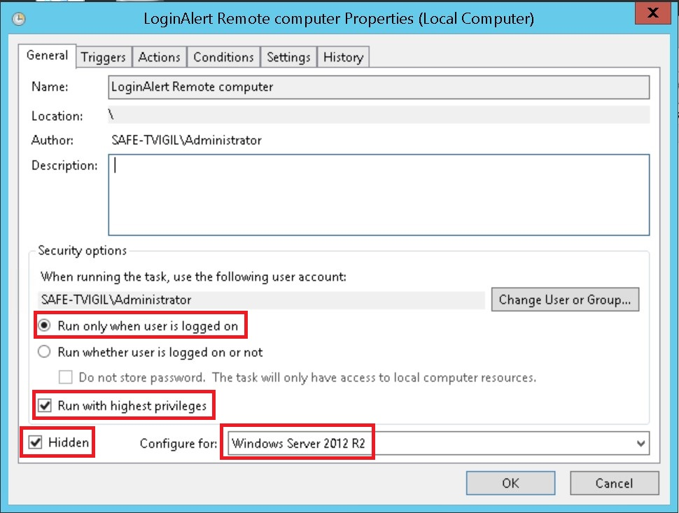
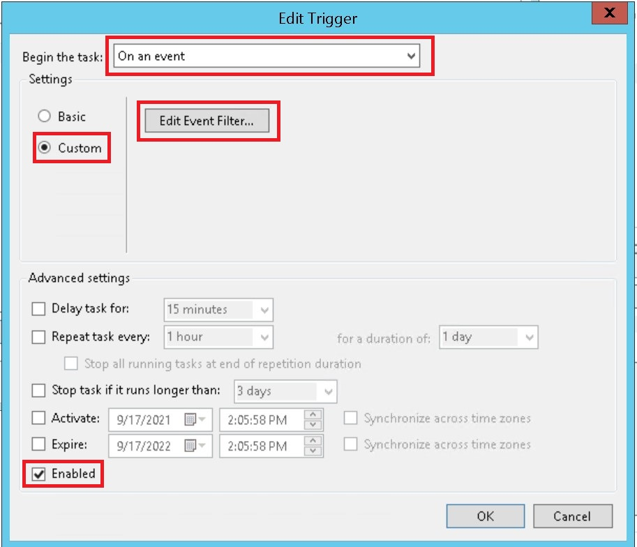
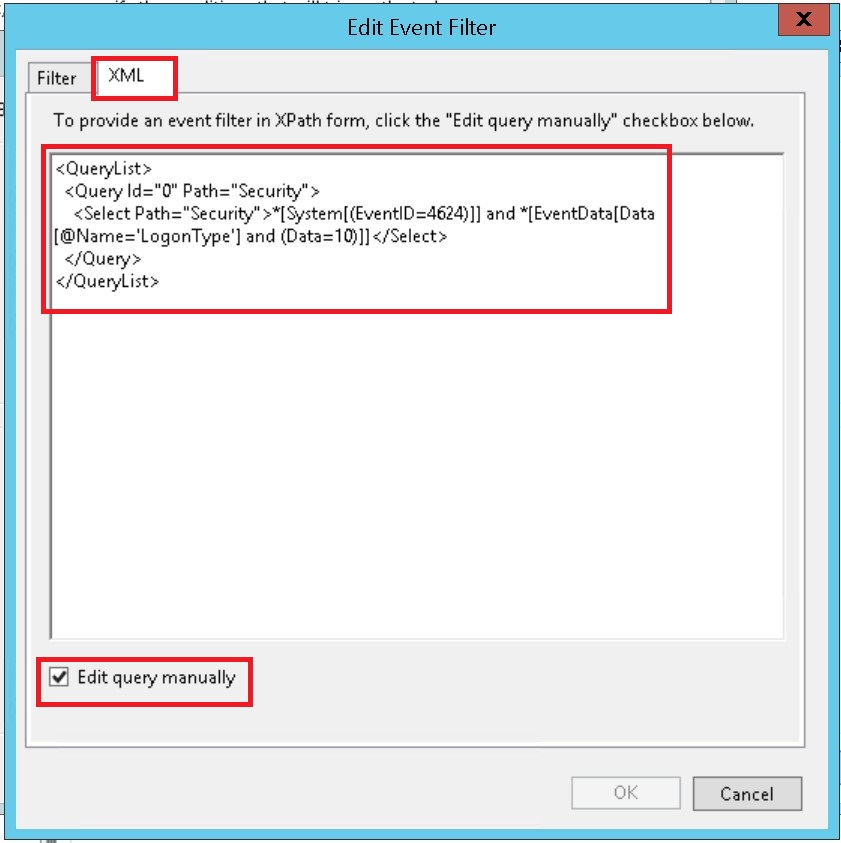
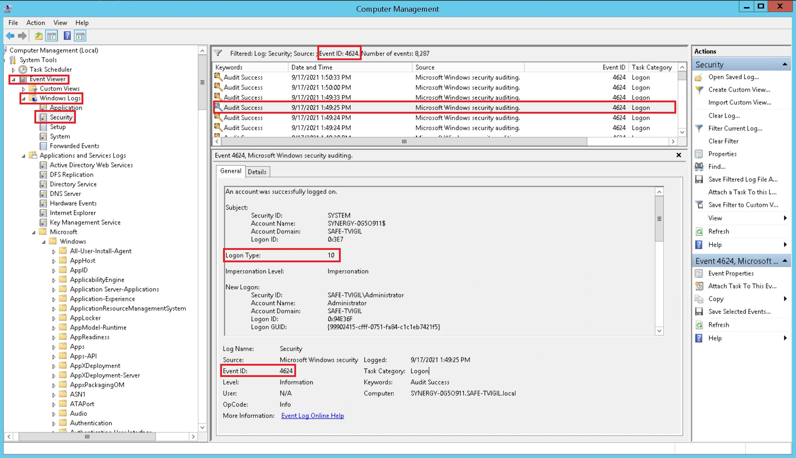
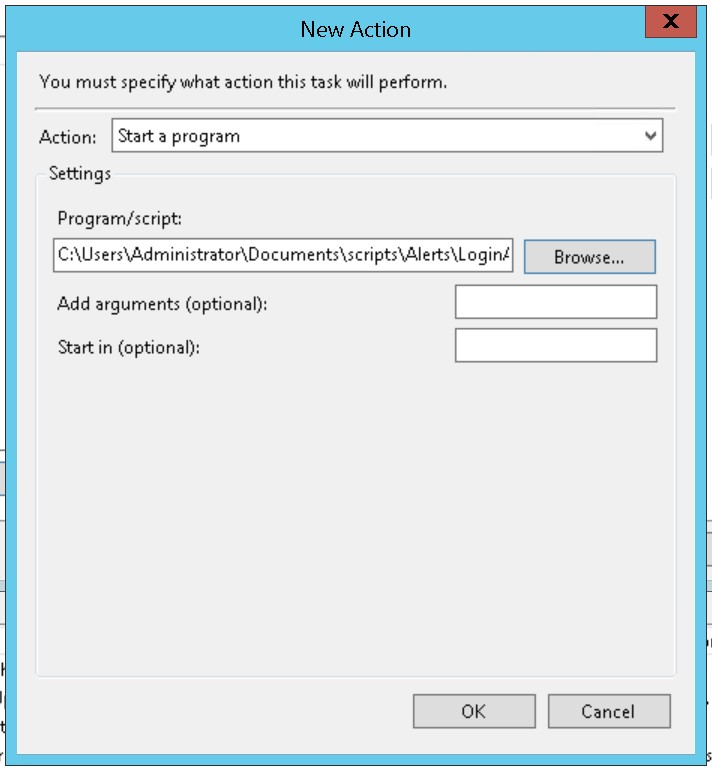

# LoginAlert C# Console Application

Sends a Telegram notification when someone logs into a windows server 2012 edition.

## Steps

Add the exe to your computer

### Step 1

Open *Task Scheduler* and click on `Create Task`.

[](img/1.jpg)

### Step 2

Give your task a name and description. Select Run only when user is logged on.

Choose your OS and run with admin privileges.

[](img/2.jpg)

### Step 3

Select the triggers tab and click on new event

[](img/3.jpg)

### Step 4

Select on an event, click on custom and then click on event filter.

[](img/4.jpg)

### Step 5

Select the filter tab and click on edit query manually.

now we need to add a custom _XML filter_ to catch Remote desktop sessions only when they sucessfully logged in.

```XML
<QueryList>
  <Query Id="0" Path="Security">
    <Select Path="Security">*[System[(EventID=4624)]] and *[EventData[Data[@Name='LogonType'] and (Data=10)]]</Select>
  </Query>
</QueryList>

```

[](img/5.jpg)

### Step 6

Example of event _ID 4624_ with login _type 10_ (successfully logged into a remote session on windows 2012)

[](img/6.jpg)

### Step 7

Remember to click on the new action tab to set the action on event process.

In this case I just run my custom telegram notification _exe_.

[](img/7.jpg)


