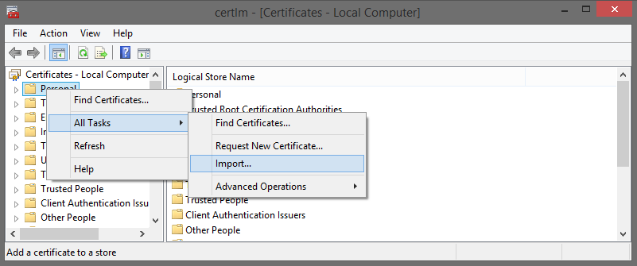
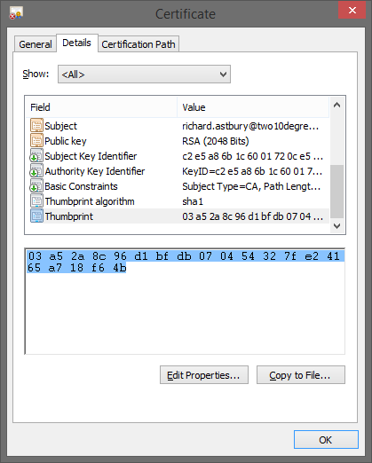

Scripts
=====================

1. **GenerateTestCertificate**    
    Args: [].  
    *Generates a test certificate using a user data. (requires OpenSSL)*

2. **SetSsl**   
    Args: *pfxPath* - PFX certificate path, *password* - PFX certificate password, *port* - HTTPS port.  
    *Imports the specified certificate into the local store and makes the corresponding HTTPS reservation.*

**Remarks**  
+ To create a test certificate OpenSSL is needed.

---

# Enabling SSL for Self Hosted Nancy

https://coderead.wordpress.com/2014/08/07/enabling-ssl-for-self-hosted-nancy/

One of the things I like about `Nancy` is the ease of creating self hosted HTTP services.

Here’s how to enable HTTPS for your service.

First of all, create your SSL certificate:

open cmd as admin

cd to: `cd C:\Program Files\OpenSSL-Win64\bin`

```BAT
$ openssl req -x509 -newkey rsa:2048 -keyout F:\key.pem -out F:\cert.pem
```

`PEM passphrase= qwoper23`

```BAT
$ openssl pkcs12 -export -in C:\xampp\apache\ssl\certificate.crt -inkey C:\xampp\apache\ssl\private.key -out C:\xampp\apache\mycert.pfx
```
`Export Password= qwoper23`

Then go to "Manage Computer Certificates" in the start menu (I'm using Windows 8.1).

Right click on "Personal" and import the freshly created `mycert.pfx`.

[](img/untitled2.png)

Now go to your newly installed certificate, and get the thumbprint:

[](img/untitled21.png)

‎`9d 44 de aa cf 6b a7 ef 91 47 98 9b f5 8d c3 79 80 a9 49 8f`

Now you need to register the URL with Windows:

```BAT
$ netsh http add urlacl url=https://+:1337/ user=Administrator
```

```
$ netsh http delete urlacl url=https://+:1337/

```

```BAT
$ netsh http add sslcert ipport=0.0.0.0:1337 certhash=1e821633c7ab2ecda8cb0486793d0e8341efc24a appid={9273cce9-a795-4525-8123-0ef2dfda2919}
```

```BAT
$ netsh http delete sslcert ipport=0.0.0.0:1337
```

You need to substitute your username, and the certificate thumbprint you copied (without the spaces)

The appid is just a random guid, feel free to create your own.

Now start nancy on this Uri https://localhost:1337/.

```C#
using (var host = new NancyHost(new Uri("https://localhost:1337/")))
{
    host.Start();
    Console.ReadKey();
}
```