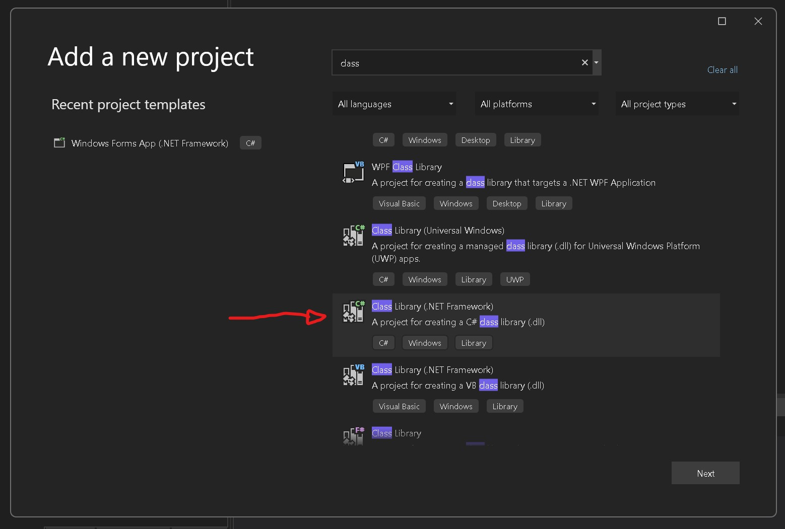
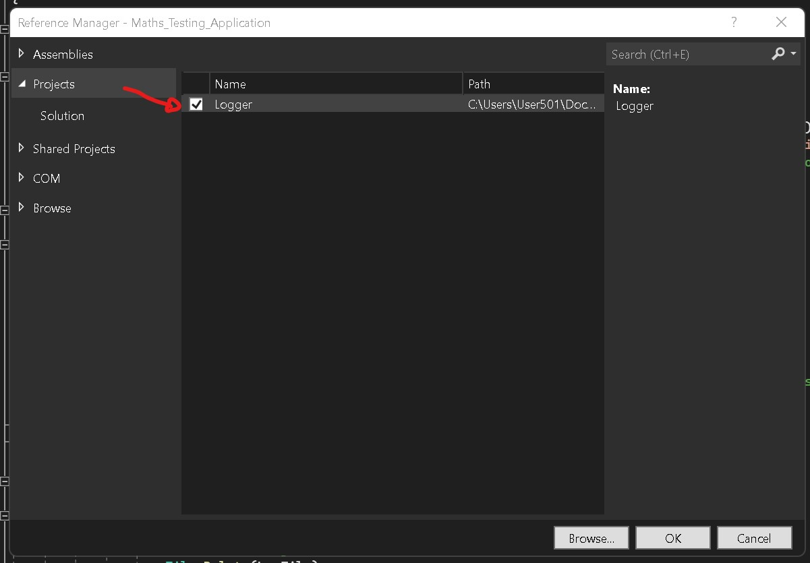
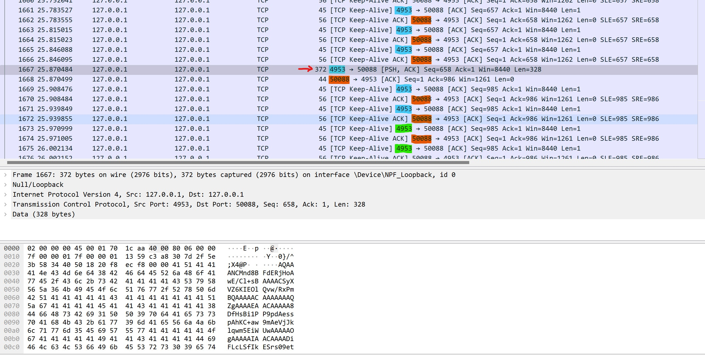
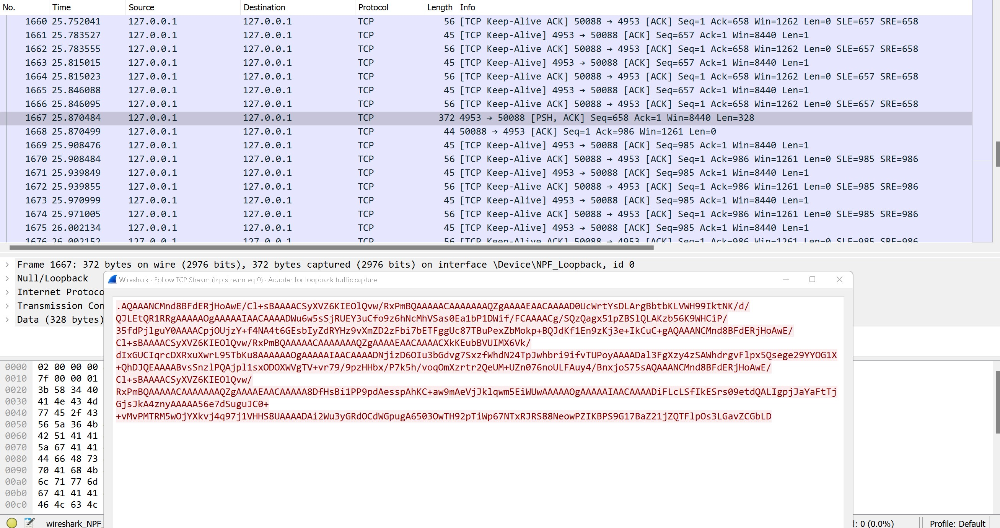

# Maths Testing Application

*Developed by C.A Torino, TECHRAD*
* Links to TECHRAD(ZA).
    * [Website](https://techrad.co.za)
    * [Tutorials site](https://tutorials.techrad.co.za)
    * [API site](https://tutorials.techrad.co.za/api)
    * [Support site](https://support.techrad.co.za)
    * [F&Q](https://faq.techrad.co.za)

    

---

This application is a Maths testing manager.

The test sends live data to the maths testing server.

* this data consists of:

    * information of the computer in which the test is running
    * begin time and end time of the test
    * current time of the test
    * number of questions answered/not answered
    * number of correct answers.
     
This information can then be used to compile a graph of all the students progress in real time. Struggeling students can then be helped via a pause button located on the server side computer.
      
Once the student has been helped a resume button can be clicked and the test will resume.
       
All events are logged in a log file for further analysis.

## Choosing a class library

## Adding a DLL class library to the project

Basic encryption is used for the TCP commands between the clients and the server.

This encryption encrypts the data via a salt present on the server and on all the clients.

This is just an example method in future a propper Diffie–Hellman key exchange end to end method will be implemented.

