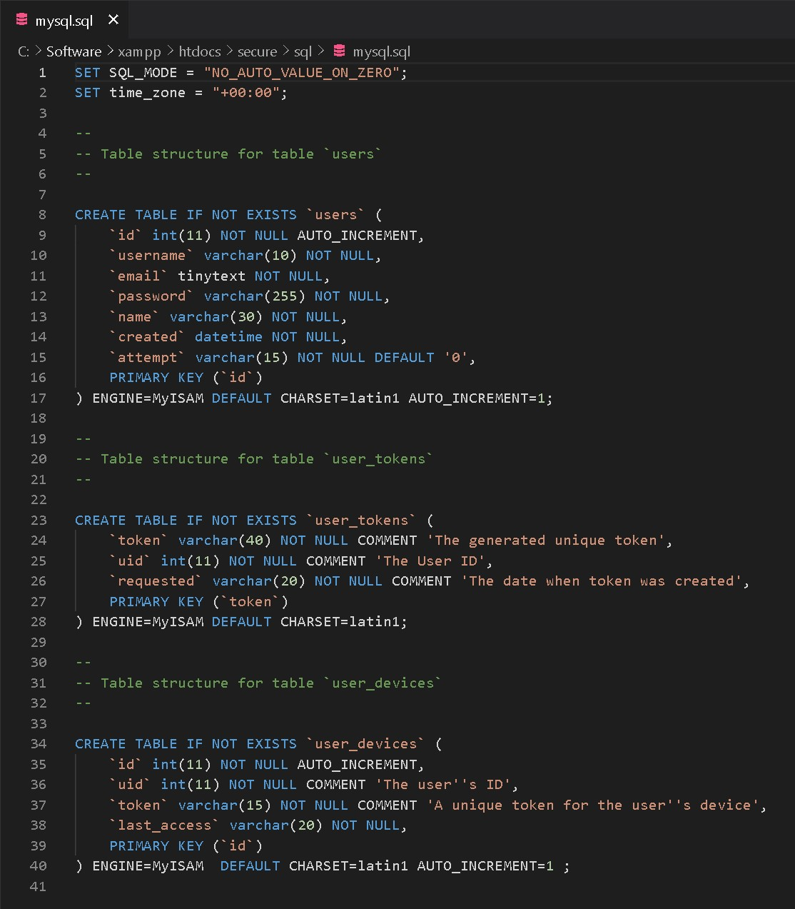
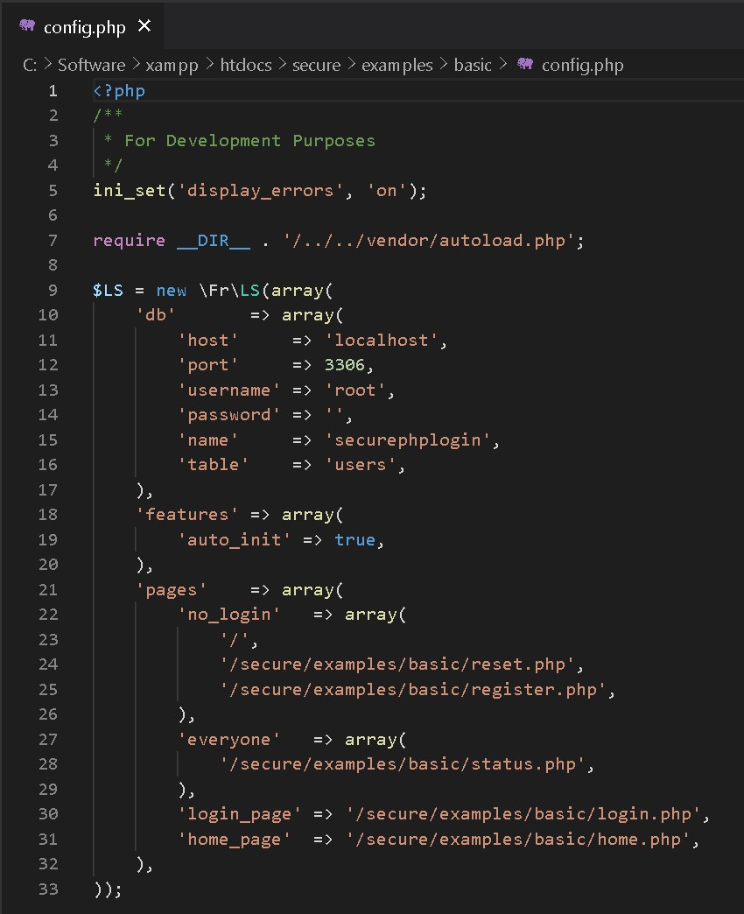

# PHP secure login system

download the `logSys` source code from
```
https://github.com/subins2000/logSys
```

Download the non-blocking session handler for PHP from
```
https://github.com/duncan3dc/sessions
```
## Summary

This class can register and login users using a database via PDO.

It can process the registration of a user given the user name, password, name and email address.

It can also authenticate a user given the user name and password and optionally set a cookie to remember the user name on the next login.

The class starts a session for successfully authenticated users.

It can also log out by ending the user session, send a password reminder message and change the user password.

It also implements a two step login process similar to that of Google's, Facebook's SMS security process.

The user can see they devices they used to log in as well as log out from a device used before.

The class also provides an administration interface to manage users, edit details, see statistics, etc..

https://www.phpclasses.org/package/8633-PHP-Register-and-login-users-using-a-database-via-PDO.html

# Steps

### 1. Import SQL DB

Import the `mysql.sql` file in phpmyAdmin to the DB named `securephplogin`

[](img/1.jpg)


### 2. Re-name root folder

Re-name the root folder to `secure` in the `config.php` file. like i have done in the picture.

Now the pages should load. Do this for the `config.php` file in the `basic`, `material-design` and `two-step-login` folders.

[](img/2.jpg)

### 2. Browse to urls

http://localhost/secure/examples/basic

http://localhost/secure/examples/material-design

http://localhost/secure/examples/two-step-login

# Notes

* Email will not work correctly in localhost server has to be live.
* 2FA works; Sends 4-digit code via email; Can also revoke access.
* Normal login works; password is salted and hashed `password_hash()` with `PASSWORD_DEFAULT` option https://www.php.net/manual/en/function.password-hash.php.
* Change settings in `config.php`; All functions are located in the `/vendor/Fr/LS.php` class.

# Functions in LS class

loads config file

```PHP
public function config($config = array())
```

Add messages to log file

```PHP
public function log($msg = '')
```

Intialize
```PHP
public function __construct($config = array(), $session = false)
```

A function that will automatically redirect user according to his/her login status
```PHP
public function init()
```

Login the user
```PHP
public function login($username, $password, $remember_me = false, $cookies = true)
```

Register a user
```PHP
public function register($identification, $password, $other = array())
```

Logout the user by destroying the cookies and session
```PHP
public function logout($removeDeviceCookie = false)
```

A function to handle the Forgot Password process
```PHP
public function forgotPassword()
```

Send token to reset password
```PHP
public function sendResetPasswordToken($uid, $messageCallback = false)
```

Check if token for resetting password is valid
```PHP
public function verifyResetPasswordToken($reset_pass_token)
```

Remove a token
```PHP
public function removeToken($token)
```

A function that handles the logged in user to change her/his password
```PHP
public function changePassword($newPassword, $userID = null)
```

Check if user exists
```PHP
public function userExists($identification)
```

Check if a user ID exists
```PHP
public function userIDExists($userID)
```

Get user's info
```PHP
public function getUser($what = '*', $user = null)
```

Updates the info of user
```PHP
public function updateUser($toUpdate = array(), $user = null)
```

Get the time since user joined
```PHP
public function joinedSince($userID = null)
```

2 Step Verification Login Process
```PHP
public function twoStepLogin($identification = '', $password = '', $remember_me = false, $cookies = true)
```

Get authorized devices
```PHP
public function getDevices()
```

Revoke a device
```PHP
public function revokeDevice($device_id)
```

Get output for each states
```PHP
public function getOutput($state, $extraInfo = array())
```

Whether a user is logged in
```PHP
public function isLoggedIn()
```

Get device ID
```PHP
public function getDeviceID()
```

Check if E-Mail is valid
```PHP
public static function validEmail($email = '')
```
Get the current page URL
```PHP
public static function curPageURL()
```

Generate a Random String
```PHP
public static function randStr($length, $int = false)
```

Get the current page path.
```PHP
public static function curPage()
```

Do a redirect
```PHP
public static function redirect($url, $status = 302)
```

Send an email
```PHP
public function sendMail($email, $subject, $body)
```

CSRF Protection
```PHP
public function csrf($type = '')
```


