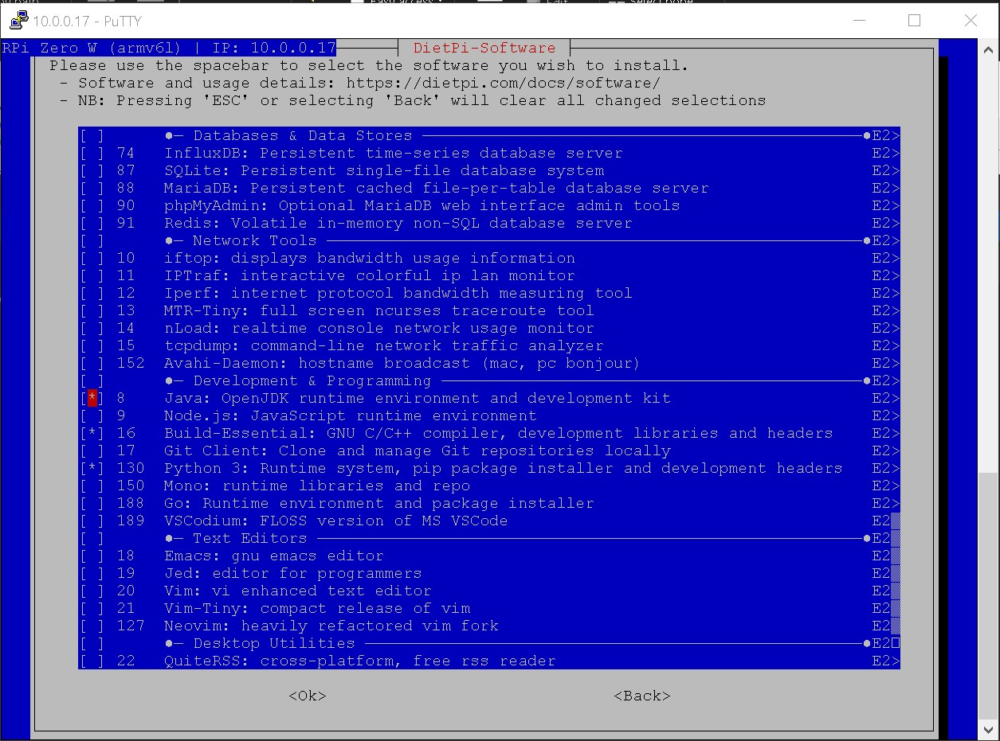
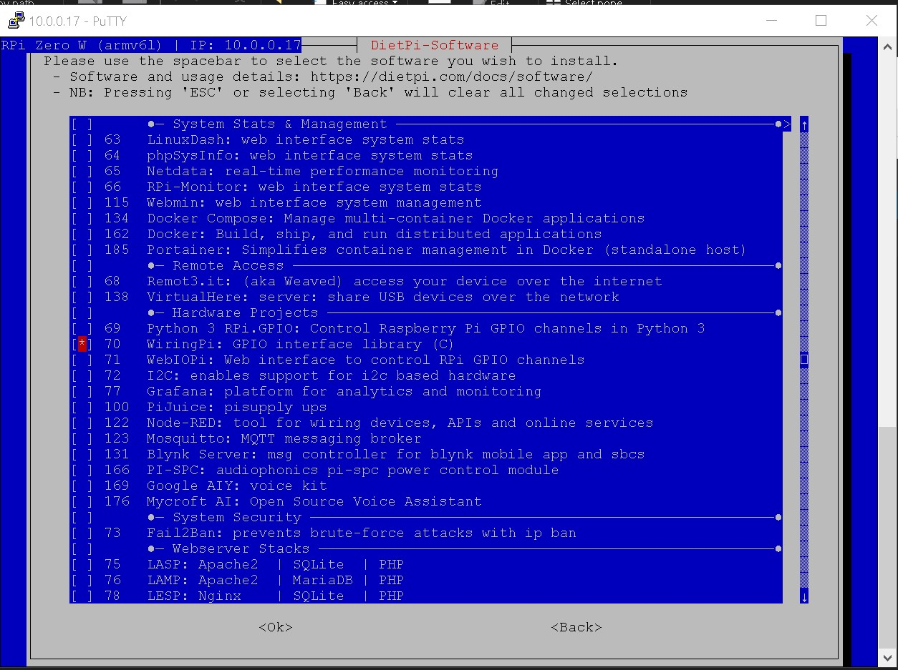
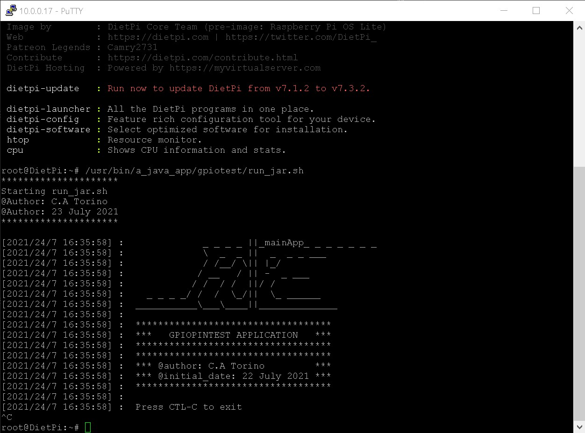
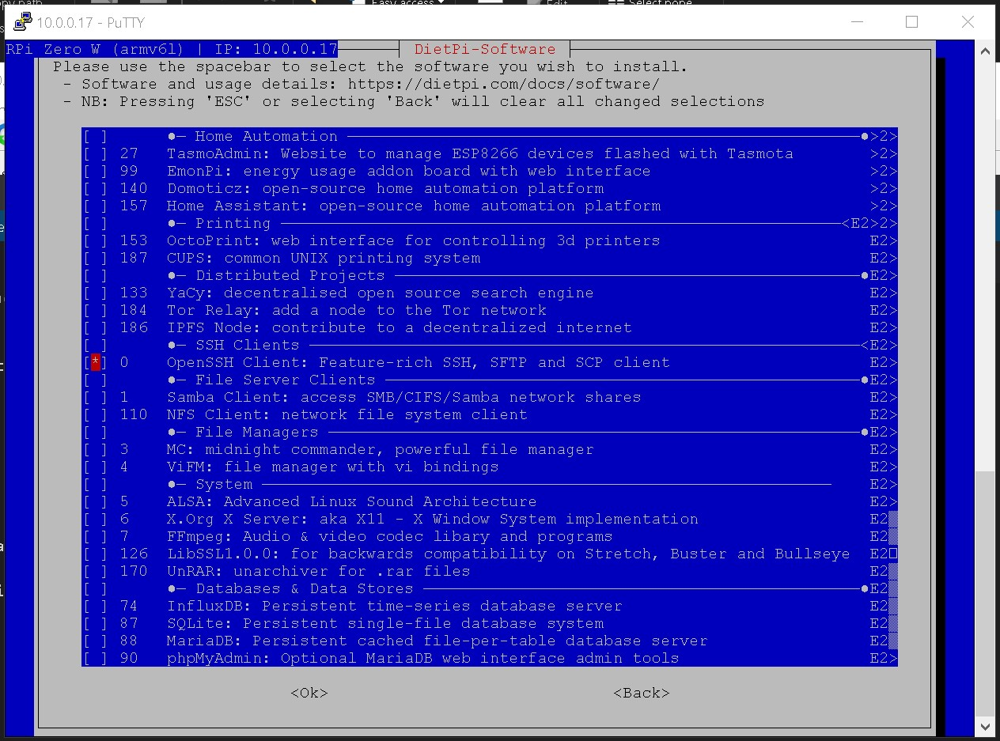
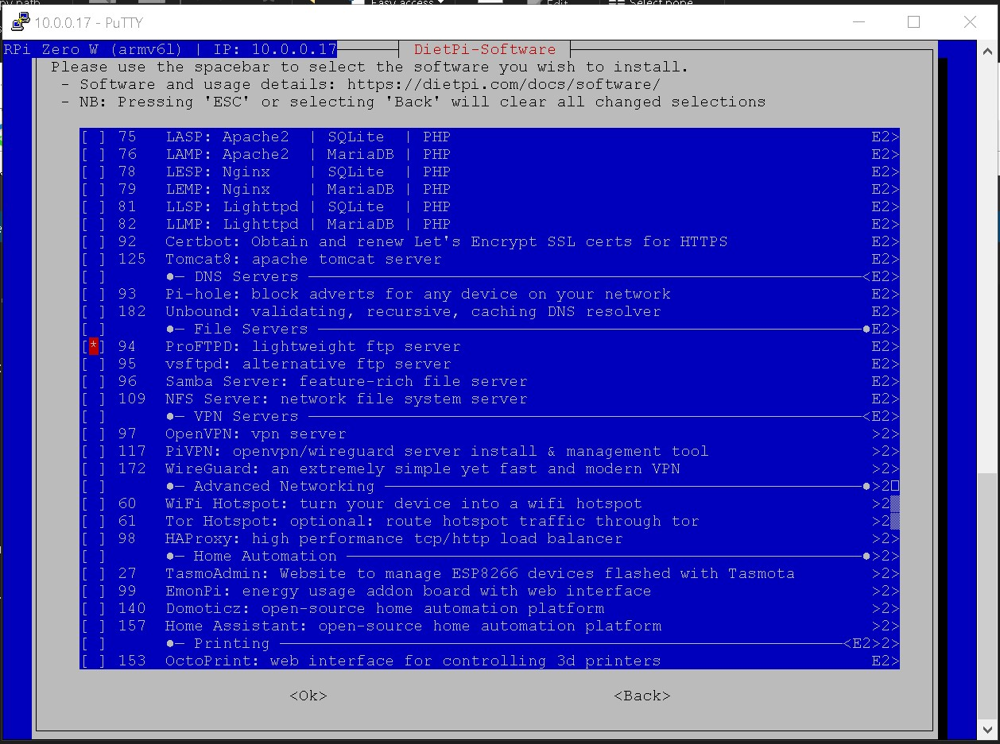

# [JAVA] Operating IO pins on the Raspberry PI Zero W

[](img/4.png)

Make sure `Java` & the `WiringPi` library is installed on your DietPi instance.

Open the dietpi-launcher.

```Bat
sudo dietpi-launcher
```

Install Optimized Software > Browse Software > Java

[](img/java.jpg)

Install Optimized Software > Browse Software > WiringPi

[](img/wireingpi.jpg)


# Setting up the APP

Compile the app with Eclipse.

Now build the `.class` files into a `.jar` file on windows.

This makes one `.jar` file and compresses it for easy distribution.

Make sure `JavaSE-1.8` is selected in Eclipse so that it can run on the PI's `openjdk version "1.8.0_212"`.

```Bat
"C:\Program Files\Java\jdk-16.0.2\bin\jar" cvfm GPIOPinTestMain.jar manifest.txt GPIOPinTestMain.class
```

N.B The manifest file must have an open newline at the end!

```Manifest
Manifest-Version: 1.0
Main-Class: GPIOPinTestMain

```

Once the `.jar` file is created you can now upload it to the PI's usr dir e.g `"/usr/bin/a_java_app/gpiotest"`

## Run the pi via a shell script

[](img/5.jpg)

```Shell
#!/bin/sh
#Java home path
JAVA_HOME=/usr/lib/jvm/java-1.8.0-openjdk-armhf
#Java class path
CLASSPATH=/usr/bin/a_java_app/gpiotest
#Class name
CLASSNAME=GPIOPinTestMain
##Run
echo "*********************"
echo "Starting run_jar.sh"
echo "@Author: C.A Torino"
echo "@Author: 23 July 2021"
echo "*********************"
echo ""
## nohup * * * * * /usr/bin/a_java_app/gpiotest/run_jar.sh &
## sudo chmod +x /usr/bin/a_java_app/gpiotest/run_jar.sh
## crontab -l
## reboot
$JAVA_HOME/bin/java -jar $CLASSPATH/$CLASSNAME.jar
echo "Done"
exit 0
```

## APP CODE

```Java
import java.text.DateFormat;
import java.text.SimpleDateFormat;
import java.util.Date;

/**
 * 
 */

/**
 * @author C.A Torino 
 *
 */
public class GPIOPinTestMain {

	/**
	 * @param args
	 */
	public static void main(String[] args) {
		// TODO Auto-generated method stub
		//need to install wiringpi on dietpi first
    	LogWindow("             _ _ _ _ ||_mainApp_ _ _ _ _ _ _");
    	LogWindow("             \\  _  _ ||  _  _ _ ___");
    	LogWindow("             / /__/ \\|| |_/");
    	LogWindow("            / __   / || -  _ ___");
    	LogWindow("           / /  / /  ||/ /");
    	LogWindow("   _ _ _ _/ /  /  \\_/||  \\_ ______");
    	LogWindow(" ___________\\___\\____||______________");
    	LogWindow("");
    	LogWindow(" ***********************************");
    	LogWindow(" ***   GPIOPINTEST APPLICATION   ***");
    	LogWindow(" ***********************************");
    	LogWindow(" ***********************************");
    	LogWindow(" *** @author: C.A Torino         ***");
    	LogWindow(" *** @initial_date: 22 July 2021 ***");
    	LogWindow(" ***********************************");
    	LogWindow("");
    	
    	TestingA();
	}
	
	public static void Led()
    {
		LogWindow(" Press CTL-C to exit");
		try 
		{
			//Runtime r = Runtime.getRuntime();
			//r.exec(new String[] {"sudo", "gpio", "mode", "4", "out"});
			//r.exec(new String[] {"sudo", "gpio", "write", "4", "1"});
			//Thread.sleep(500);//500
			//r.exec(new String[] {"sudo", "gpio", "write", "4", "0"});
			Runtime r = Runtime.getRuntime();
			r.exec("gpio mode 4 out");
            r.exec("gpio write 4 1");
			Thread.sleep(500);
			r.exec("gpio write 4 0");
			Thread.sleep(500);
			//while(true) 
			//{
				//r.exec("gpio write 4 1");
				//Thread.sleep(500);
				//r.exec("gpio write 4 0");
				//Thread.sleep(500);
			//}
			
		}
		catch(Exception e) 
		{
			LogWindow("Exception: " + e.getMessage());
		}
		
		LogWindow(" Testing Complete");
    }
	
	public static void LogWindow(String txt)
    {
		DateFormat dateFormat = new SimpleDateFormat("yyyy/dd/M HH:mm:ss");
		Date date = new Date();
        System.out.println("[" + dateFormat.format(date) + "] : " + txt);
    }
	
}
```

Install OPENSSH to allow `Putty` connections.

[](img/openssh.jpg)

INSTALL ProFTPD so allow `sftp://10.0.0.17` connections.

[](img/proftpd.jpg)


