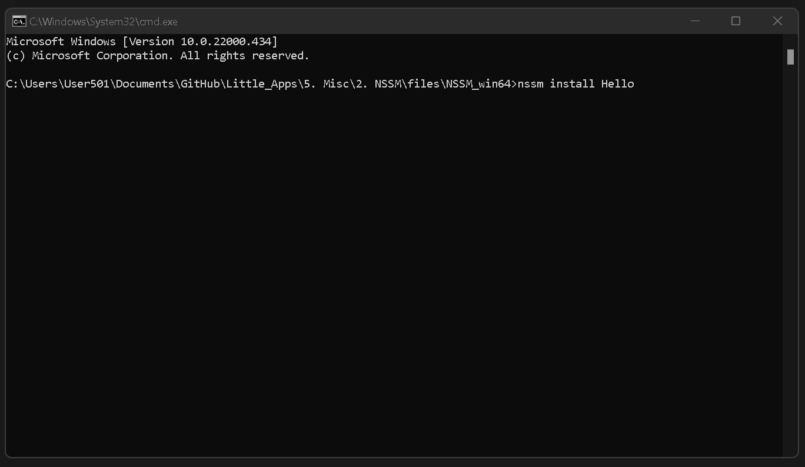
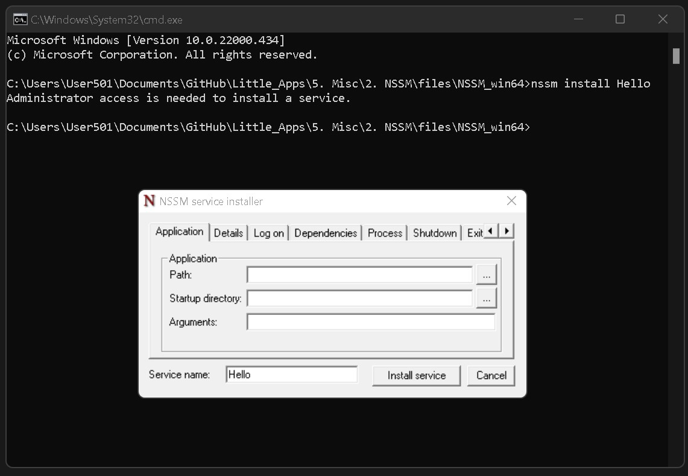

# NSSM

https://nssm.cc

https://nssm.cc/download

Non-Sucking Service Manager

## STEPS

### 1.

CD into dir with nssm.exe

```
CD C:\test\testdir
```

### 2.

Run the install service with the specified program you want to install as a service

```
nssm install Hello
```

[](img/1.jpg)

### 3.

Fill in the required fields

[](img/2.jpg)