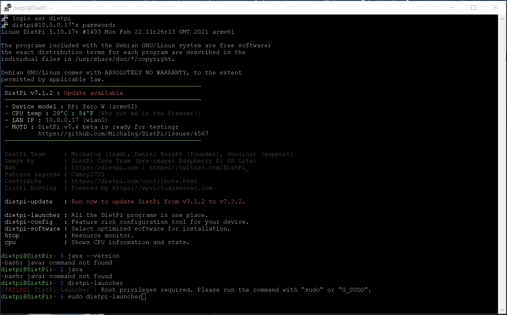
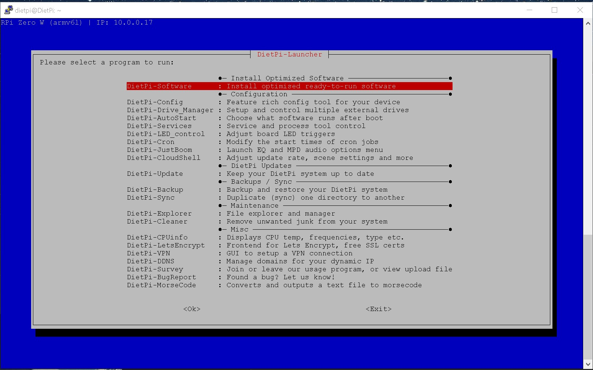
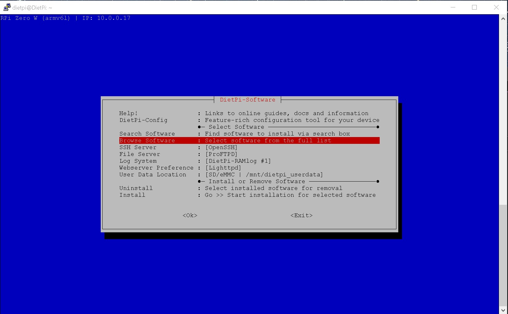
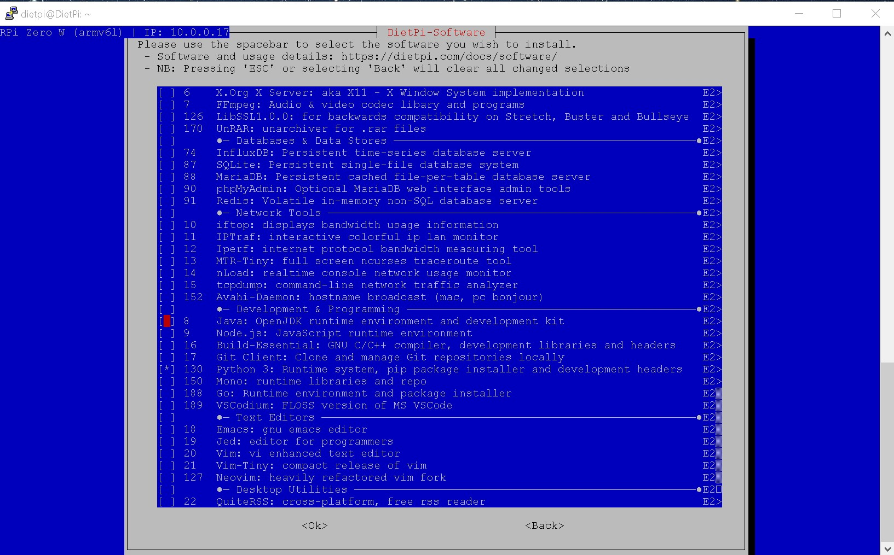
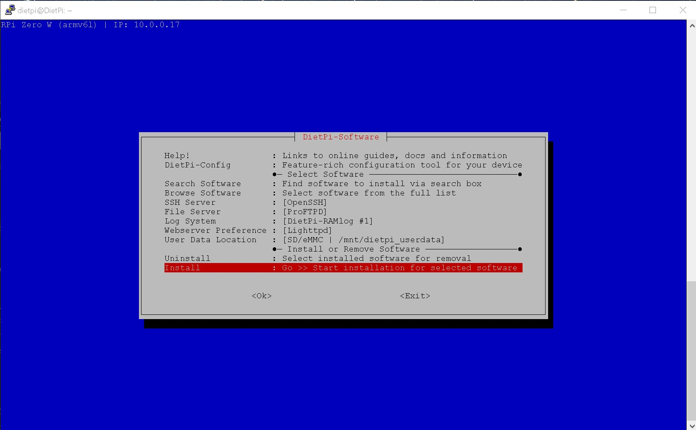
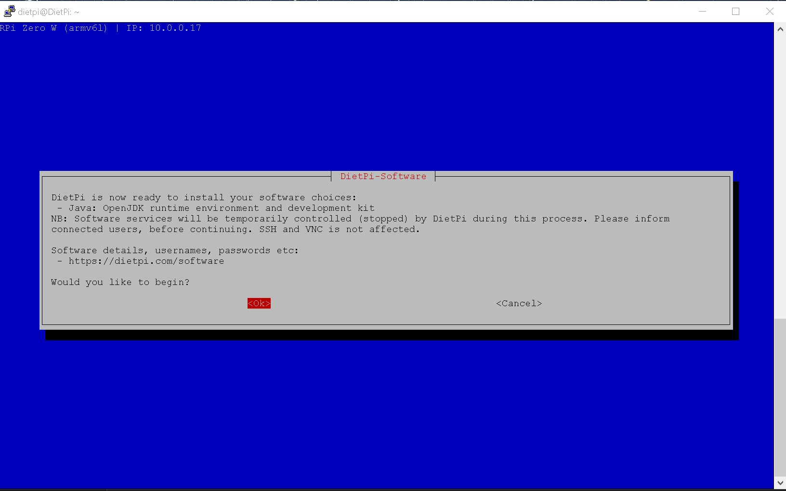
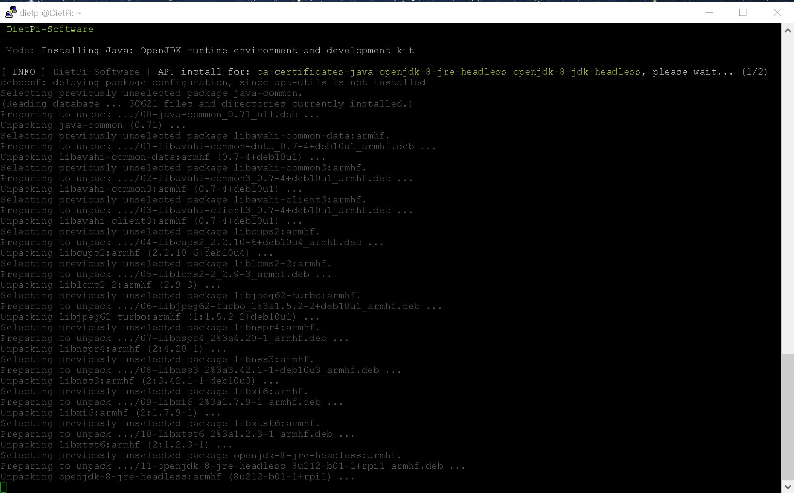
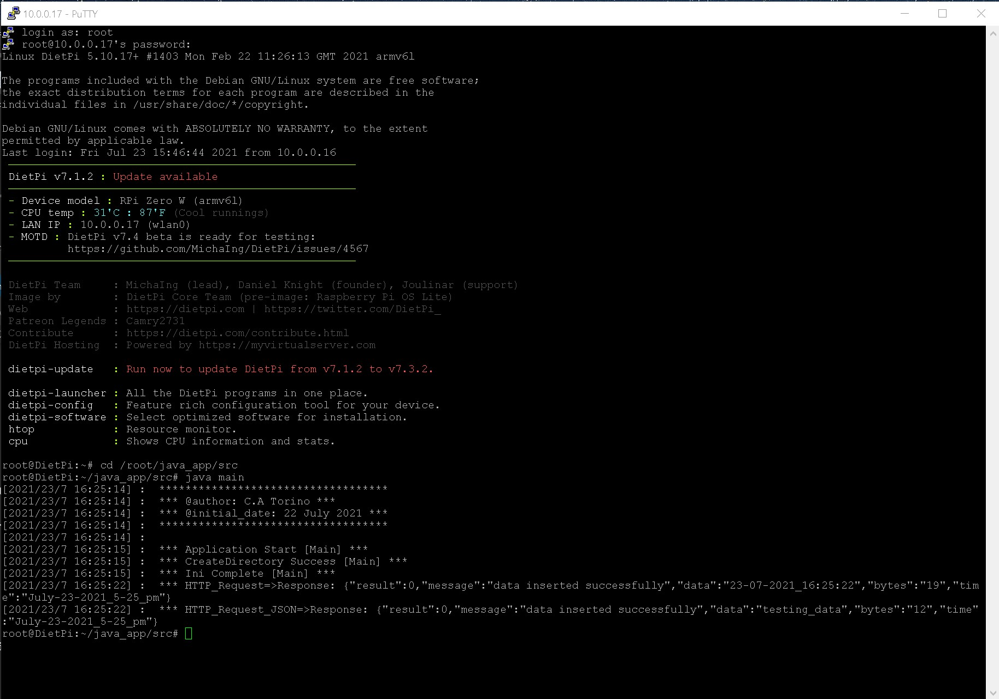
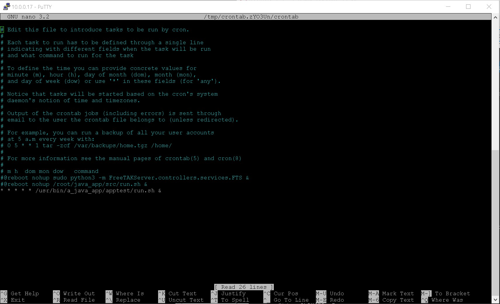

# Install Java on DietPi

Installing **`openjdk-8-jre-headless`** because the new versions don't work on the **`PI ZERO`** however on the **`PI3`** and **`PI4`** Java SE comes standard with the deafult PI image.

Make sure the DietPi instance is updated.

Now ssh into the DietPi instance.

FTP DETAILS:

* H: sftp://10.0.0.17
* U: root
* P: dietpi

1. After entering credentials run:

```Bat
sudo dietpi-launcher
```
[](img/1.jpg)

--------------------------------

2. Select the **`Install Optimized Software`** option:

[](img/2.jpg)

--------------------------------

3. Select the **`Browse Software`** option:

[](img/3.jpg)

--------------------------------

4. Select the **`Java`** option:

[](img/4.jpg)

--------------------------------

5. Select the **`Install`** option:

[](img/5.jpg)

--------------------------------

6. Select the **`Ok`** option:

[](img/6.jpg)

--------------------------------

7. The software will now install and return back to the **`dietpi-launcher`** screen when done:

[](img/7.jpg)

--------------------------------

Check the java version:

```Bat
java -version
```

returns:

```Bat
openjdk version "1.8.0_212"
OpenJDK Runtime Environment (build 1.8.0_212-8u212-b01-1+rpi1-b01)
OpenJDK Client VM (build 25.212-b01, mixed mode)
```

---
# Running a Java app on DietPi

open cronjobs:

```Bat
crontab -e
```

## Run app from cmd

[](img/8.jpg)

1. Filezilla open PI ZERO file structure **`sftp://10.0.0.17`**.

2. Add java program files to dir.

3. CD to directory.

```Bat
cd /usr/bin/a_java_app/apptest
```

4. Compile on the pi because if it's compiled on anothe pc it won't work

```Bat
javac main.java
```

5. Run the app.

```Bat
java main
```

---

## Shell script to run app

Use a script to run the app and add it to a crontab.

https://stackoverflow.com/questions/32804020/create-a-shell-script-to-run-a-java-program-on-linux

1. Create a shell with name "run.sh"

```bat
cat > run.sh
```

```sh
#!/bin/sh
#Java home path
JAVA_HOME=/usr/lib/jvm/java-1.8.0-openjdk-armhf
#Java class path
CLASSPATH=/usr/bin/a_java_app/apptest
#Class name
CLASSNAME=main
##Run
echo "*********************"
echo "Starting run.sh"
echo "@Author: C.A Torino"
echo "@Author: 23 July 2021"
echo "*********************"
echo ""
## nohup * * * * * /usr/bin/a_java_app/apptest/run.sh &
## sudo chmod +x /usr/bin/a_java_app/apptest/run.sh
## crontab -l
## reboot
$JAVA_HOME/bin/java -cp $CLASSPATH $CLASSNAME
echo "Done"
exit 0
```

2. copy the script in `/usr/bin/a_java_app/apptest`

3. Give execute permission to the script:

```bat
sudo chmod +x /usr/bin/a_java_app/apptest/run.sh
```
4. Run the script:

```bat
./usr/bin/a_java_app/apptest/run.sh
```

----

## Add shell script to crontab

[](img/9.jpg)

1. open cronjobs:

```Bat
crontab -e
```

Add this line to run tab even when logged out every minute

```Bat
* * * * * /usr/bin/a_java_app/apptest/run.sh &
```

2. list all crontabs

```Bat
crontab -l
```

```Bat
crontab -u username -l
```

3. reboot the PIZERO so that the crontabs can take into effect.
```Bat
reboot
```


